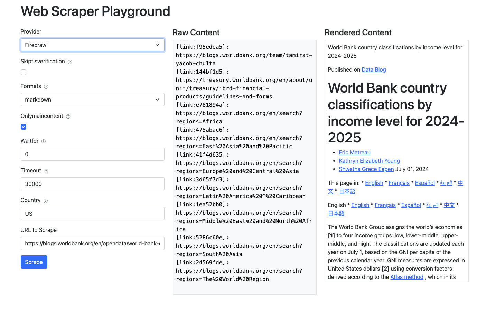

# Web Scraping Playground

A flexible web scraping playground that supports Markdown rendering. 



## Quick Start

1. Install dependencies:
```bash
pip install -r requirements.txt
```

2. Set up your environment variables for your preferred scraping provider:

For Firecrawl:
```bash
export FIRECRAWL_API_KEY=your_api_key
```

For Scrapfly:
```bash
export SCRAPFLY_API_KEY=your_api_key
```

3. Run the application:
```bash
python app.py
```


